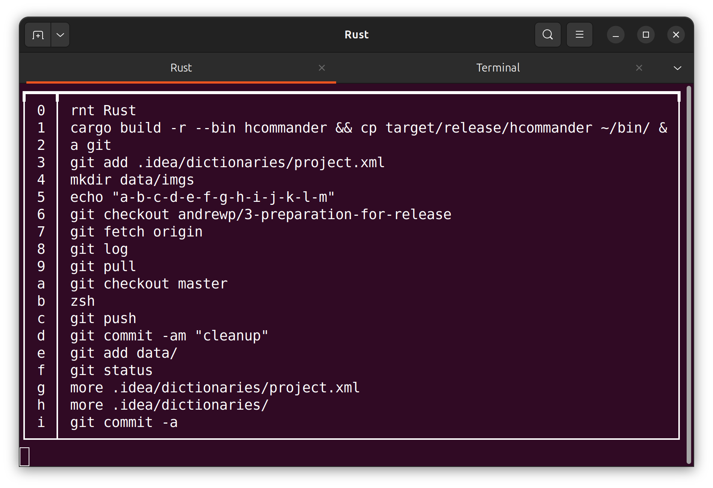

# Overview

History Commander

A command line utility to make reexecuting commands from shell history quicker and easier

Executing:

```bash
history | hcommander [regex]
```

Will read in the command history and present



Pressing 8 will close the screen and execute 'git log'

Pressing q|Q will quit without executing anything PgUp/PgDn pages through more commands

An optional regex may be added to filter specific commands(i.e. you only want see the git commands)

# Suggested installation

```bash
git clone https://github.com/AndrewOfC/hcommander.git
cd hcommander
cargo build --release --bin hcommander
cargo install --path .
```

The binary is 'monolithic', which is to say that it's self-contained, requiring no other support/datafiles, it can be copied 'raw' into /usr/local/bin, $HOME/bin or any other location you might prefer

## Shells

in .bashrc, or .zshrc

```bash
function a {
  history | <installlocation>/hcommander $1
}
```

or

```bash
alias a="history | <installation>/hcommander"
```

or

```bash
# developer option
function a {
   cd <projectdir> && history | cargo --run -r -bin hcommander  
}
```

# MacOSX

goto System Settings => Privacy & Security => Accessibility and allow hcommander to control the computer

# License

```text
 MIT License

 Copyright (c) 2026 Andrew Ellis Page

 Permission is hereby granted, free of charge, to any person obtaining a copy
 of this software and associated documentation files (the "Software"), to deal
 in the Software without restriction, including without limitation the rights
 to use, copy, modify, merge, publish, distribute, sublicense, and/or sell
 copies of the Software, and to permit persons to whom the Software is
 furnished to do so, subject to the following conditions:

 The above copyright notice and this permission notice shall be included in all
 copies or substantial portions of the Software.

 THE SOFTWARE IS PROVIDED "AS IS", WITHOUT WARRANTY OF ANY KIND, EXPRESS OR
 IMPLIED, INCLUDING BUT NOT LIMITED TO THE WARRANTIES OF MERCHANTABILITY,
 FITNESS FOR A PARTICULAR PURPOSE AND NONINFRINGEMENT. IN NO EVENT SHALL THE
 AUTHORS OR COPYRIGHT HOLDERS BE LIABLE FOR ANY CLAIM, DAMAGES OR OTHER
 LIABILITY, WHETHER IN AN ACTION OF CONTRACT, TORT OR OTHERWISE, ARISING FROM,
 OUT OF OR IN CONNECTION WITH THE SOFTWARE OR THE USE OR OTHER DEALINGS IN THE
 SOFTWARE.

 SPDX short identifier: MIT
```